# Treasury, counted in minutes

A clickable mock-up of a corporate eBanking portal for a group treasurer — Marie Lefèvre, Group
Treasurer, Paris — at **Norvane Bank** (a fictitious bank). **The bank that orchestrates, not the
rail.**

It opens on the **Monday 08:30 cash meeting**: the group position by entity, currency and bank
(including two other banks), forecast vs actual, today's cut-offs, two requests waiting for Marie's
signature and three alerts. A **value banner** at the top shows, for the chosen client profile, what
the ledger is worth a year: **local buffers released, treasury time saved, failures avoided** —
never zero, assumptions on hover. Nothing to press first.

Each alert leads into a use case, in context:

1. **Automate payments around an event** — smart contracts: purpose-bound escrow and cascade
   payments, with guardrails (cap, challenge window, kill switch, oracle liability, accounting note).
2. **Bring cash home from Brazil** — qualify the flow (dividend, loan repayment, royalties, documents,
   IOF and FX registration to validate), lock the rate, BRL → partner wallet → euro stablecoin →
   EUR on the tokenised account; the gap with FX + SWIFT broken down.
3. **Sweep the surplus into the tokenised fund** — by standing rule, redeemed automatically.
4. **Put the balance to work** — collateral (what the beneficiary receives, what it does to
   published cash and net debt) and a funding buffer, counted to the minute.
5. **Pre-validate a large transfer** — orchestration available today; only "beneficiary on the
   ledger" is new, and labelled not right away.
6. **Fund a subsidiary just in time** — local buffers in Tokyo, Riyadh and Singapore go; one-off or
   standing rule.

Around them: **maker / checker** on every action (initiator, second signatory within mandate, audit
trail), **In your TMS** (the same position by camt.052/053, a rule set by API, the statement line
your team reconciles, what to sign and connect), **Incidents** (expired rate lock, night FX limit,
screening hit at release), and a **Business case** for the bank (client value, NII cost of the units,
revenues, cannibalisation, horizon and dependency of each use case). Each use case carries its
horizon — available today, H1 2027, H2 2028, H3 2029+ — and what it depends on.

Everything runs in the browser: mock data, a simulated week, no backend, no login. Amounts are
illustrative.

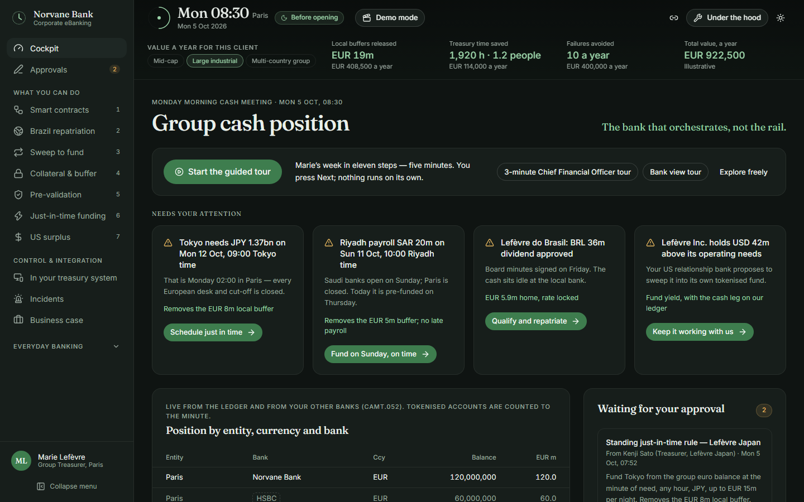

## Run it (under 3 minutes)

You need [Node.js](https://nodejs.org) 20 or later.

```bash
git clone <this repository>
cd <folder>
npm install
npm run dev
```

Open <http://localhost:5173>. That's it.

## Use it

- The **cockpit** is already filled in on Monday 08:30. Follow an alert, or approve a request.
- The **value banner** changes with the client profile (mid-cap, large industrial, multi-country
  group). Hover each figure for its assumptions.
- **Every action asks for a second signature** (maker / checker). In the demo you can give it
  yourself; the audit trail is on the Approvals page.
- **Demo mode** (top bar) shows the clock controls: Play, Next event (⏭), the week timeline and the
  week's interest counters. Use it to follow a repatriation or a contract to the end.
- **Under the hood** shows ledger entries to the second, rule decisions, accruals, the ALM view and
  intragroup mirror balances — and links to the Business case.
- The URL carries the clock (`?t=2026-10-10T21:00`): copy it to share a moment.

| Use case                | Start here                            | What to do                                                      |
| ----------------------- | ------------------------------------- | --------------------------------------------------------------- |
| Smart contracts         | `/smart-contracts?t=2026-10-12T11:00` | Deploy the cascade, simulate the event, Demo mode → ⏭           |
| Brazil repatriation     | `/repatriation?t=2026-10-10T21:00`    | Qualify the dividend, lock the rate, Demo mode → ⏭ a few times  |
| Sweep to fund           | `/sweep`                              | Set the threshold, make it a standing rule                      |
| Put the balance to work | `/put-to-work?t=2026-10-07T21:30`     | Collateral, beneficiary, published figures                      |
| Pre-validation          | `/pre-validation?t=2026-10-12T11:00`  | Pre-validate the M&A closing, then release it                   |
| Just in time            | `/just-in-time?preset=tokyo`          | Tokyo at Mon 02:00 Paris: schedule it, or set a standing rule   |

## The doctrine in 12 lines

1. The tokenised account is a service account: 0.10 %, never more than the current account (0.50 %).
2. Time is counted to the minute on the tokenised account; the current account counts end-of-day balances.
3. The clock follows finality: no interest before funds are final on the paying entity's books.
4. Yield lives in term units bought from the tokenised account — transferable before maturity, never broken.
5. Late cash earns: after 18:00, idle balances go into an overnight unit that minute (three-day on Friday).
6. Collateral keeps earning until the minute a rule releases it.
7. Just-in-time funding at any hour: a subsidiary pays only for the minutes it borrows.
8. Out-of-hours FX is for intragroup funding only, within a published night limit (EUR 25m).
9. The tokenised fund is an option, not the engine: settled on the ledger, within fund hours.
10. The night sweep brings cash from other banks by instant transfer and returns only what each bank needs.
11. Payments, payroll, tax, forecasting, statements, reconciliation, closing and netting do not change.
12. Across banks, not right away: payments to other banks at night, PvP and settlement with non-clients need the interbank layer (2028+) — shown with a "Not right away" label.

Full text: [docs/DOCTRINE.md](docs/DOCTRINE.md). The week: [docs/SCENARIO.md](docs/SCENARIO.md).
Choices made where the brief was silent: [docs/ASSUMPTIONS.md](docs/ASSUMPTIONS.md).

## Screens

| | |
|---|---|
| 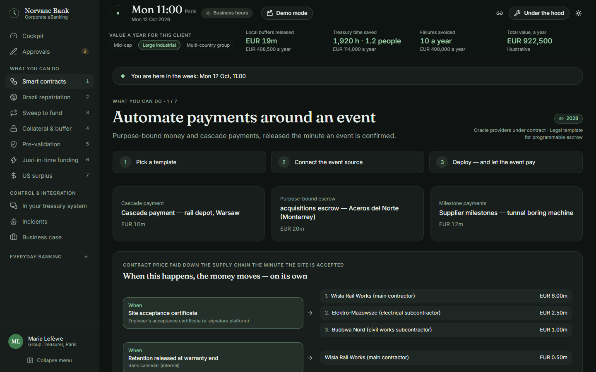 **Smart contracts** — event → payments, guardrails, API for IT. | 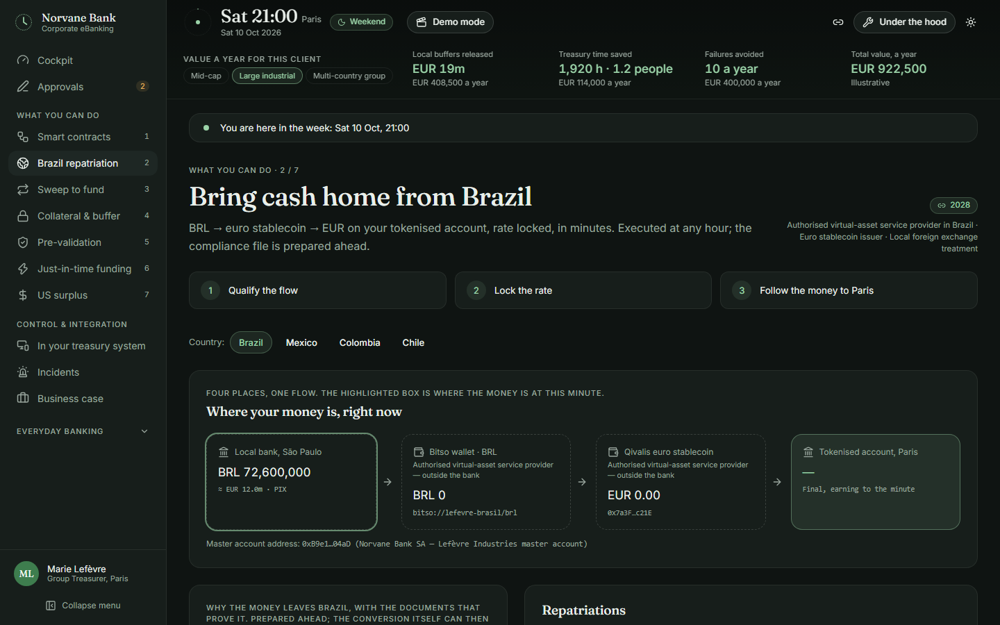 **Brazil repatriation** — qualify, lock, follow the money. |
| 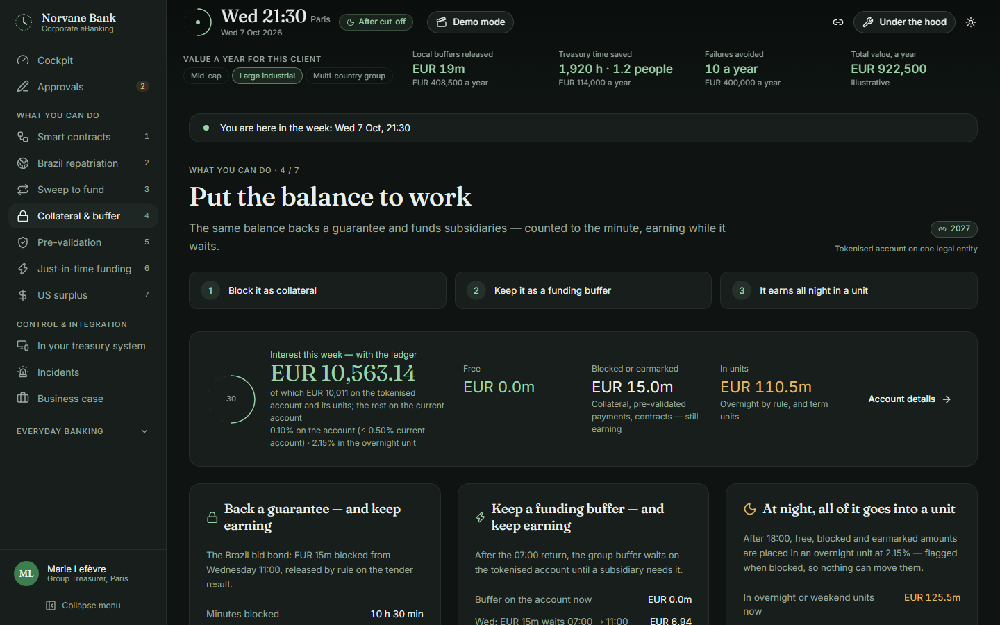 **Put the balance to work** — collateral, beneficiary, published figures. | 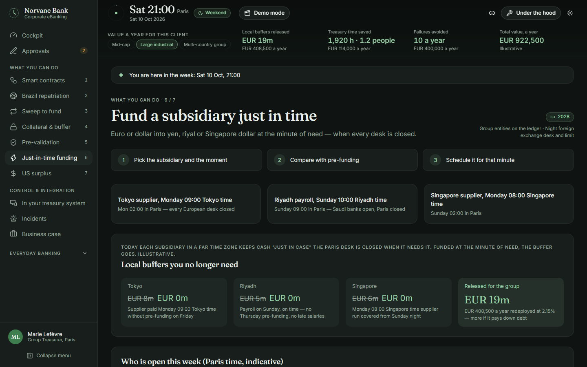 **Just in time** — buffers released, who is open, FX cost by window, lock on Friday, USD cascade. |
| 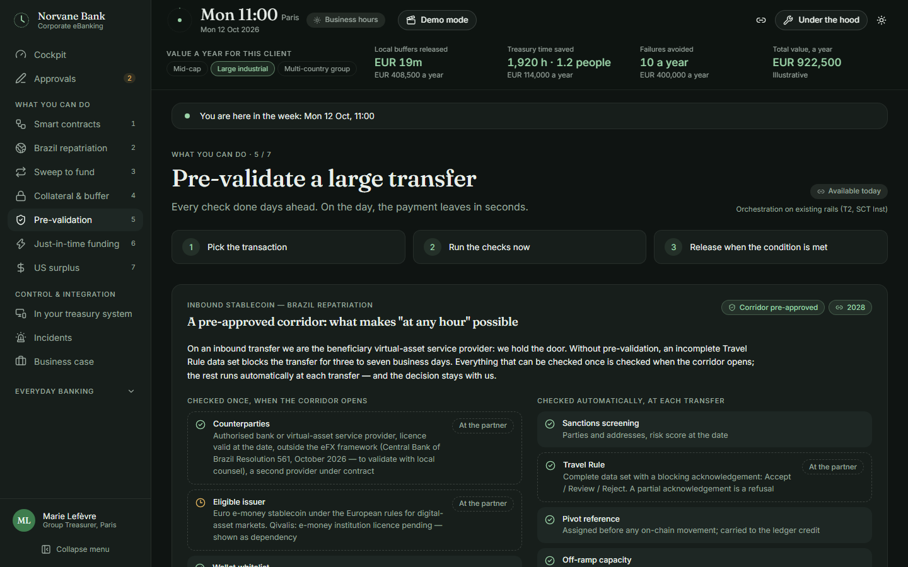 **Pre-validation** — inbound stablecoin corridor checks, and large payments (available today). | 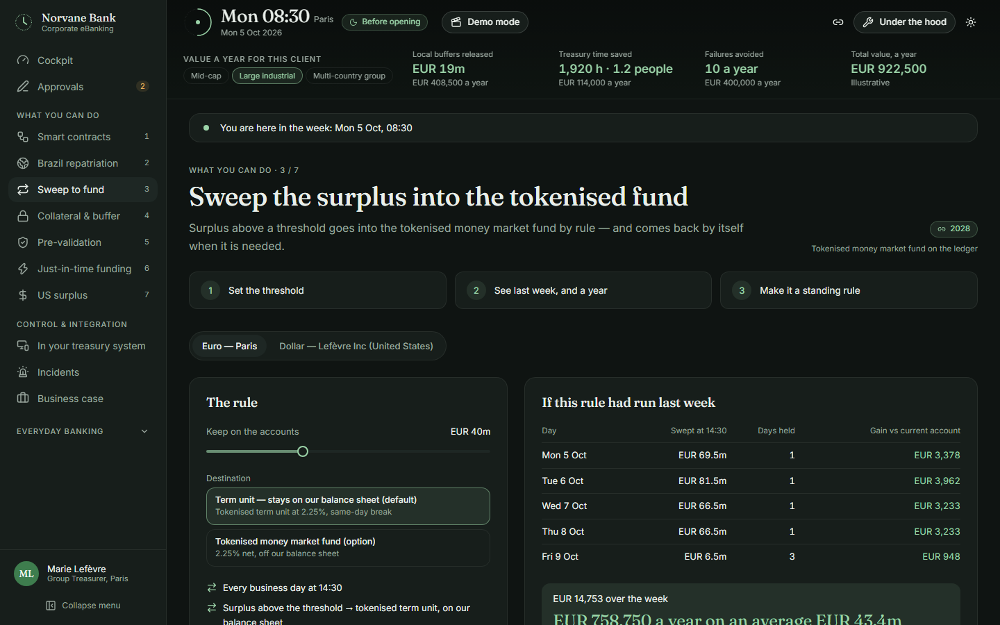 **Sweep** — EUR to a term unit (or fund), USD to a tokenised government fund. |
| 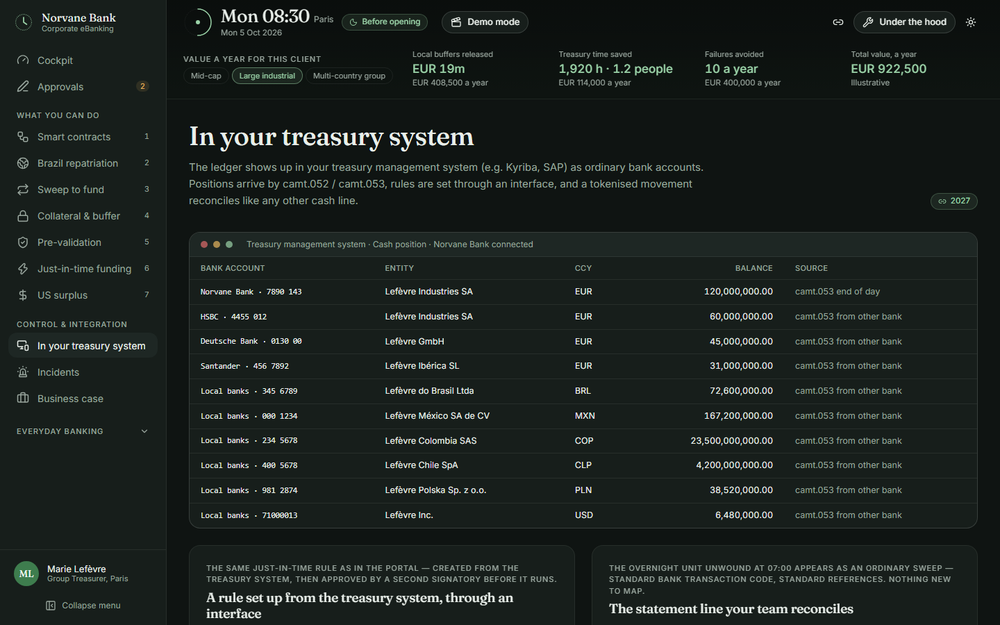 **In your TMS** — position, rule by API, statement line, onboarding. | 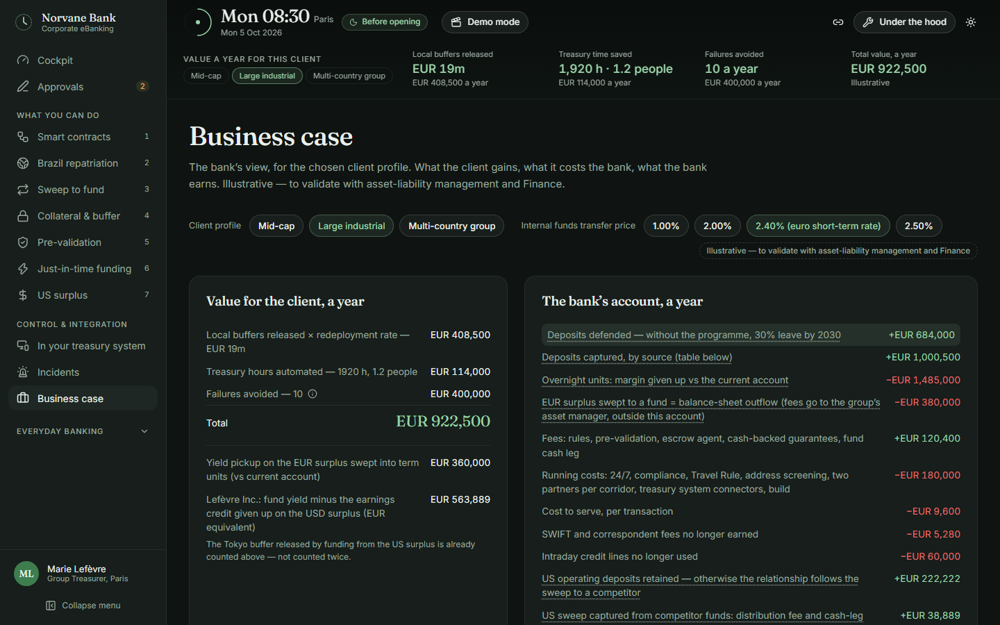 **Business case** — client value, bank account, horizons. |
| 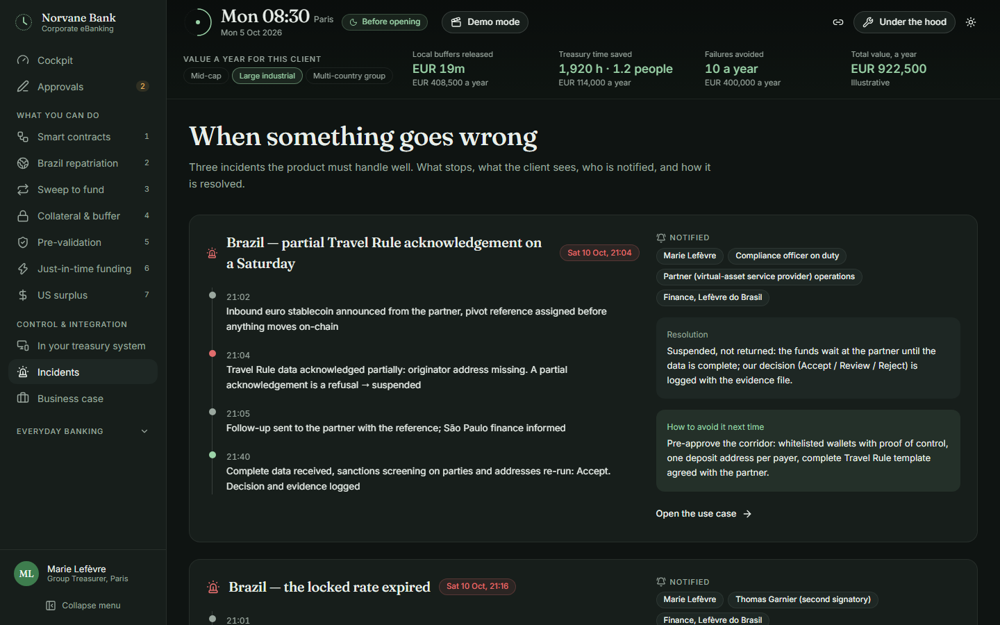 **Incidents** — what stops, who is notified, how it is resolved. | 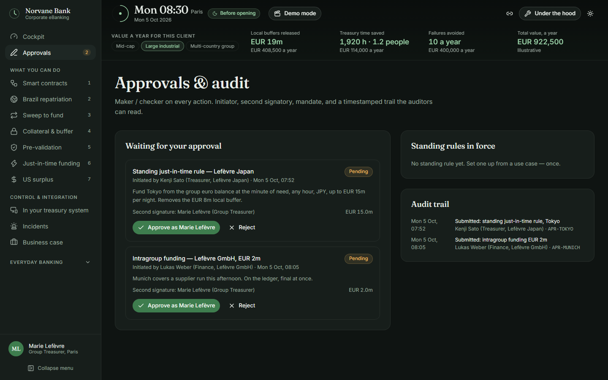 **Approvals & audit** — maker / checker, standing rules, trail. |
| 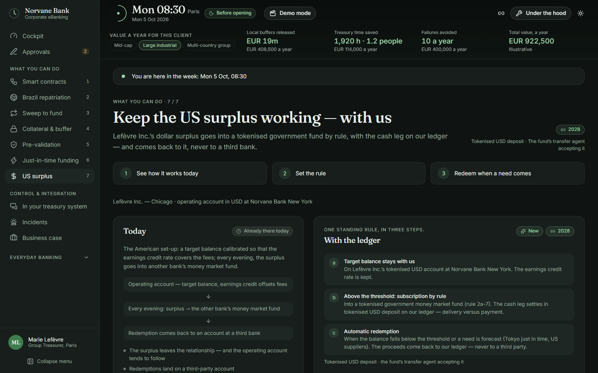 **Keep the US surplus working** — target balance kept, surplus to a tokenised government fund, cash leg on our ledger. | 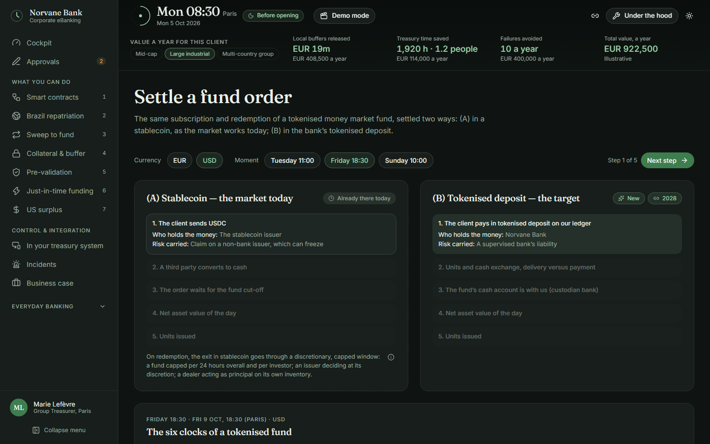 **Settle a fund order** — stablecoin vs tokenised deposit, step by step, the six clocks. |

 **Why the minute** — seven cases, including a multi-time-zone day between Singapore and Paris.

Light mode: 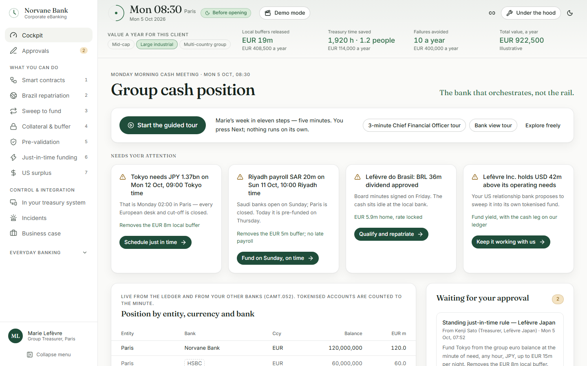

## How it is built

Vite · React 18 · TypeScript (strict) · Tailwind CSS 4 · shadcn/ui-style components on Radix ·
Zustand · Recharts · lucide-react · Framer Motion · React Router.

```
src/
  engine/     pure logic, unit-tested
    clock.ts      simulated time, business hours, cut-offs
    accrual.ts    minute accrual (Actual/360) and daily end-of-day accrual
    finality.ts   "the clock follows finality"
    rules.ts      sweep, overnight unit, night sweep, return
    pricing.ts    unit sale price, night FX quote, deposit break cost
    scenario.ts   the week as data + the traditional twin
    timeline.ts   the reducer: one snapshot per event, ledger, orchestration log
    counters.ts   the five weekly counters
    preview.ts    "if this rule had run last week…"
    userActions.ts  your actions, replayed on the week
  app/        router and Zustand store
  screens/    the 8 screens
  components/ layout, hood panel, charts, ui primitives
  data/       rates, entities, banks, accounts, rules, forecast
  i18n/en.ts  every client-facing string (add fr.ts for French)
tests/
  unit/       engine, scenario table, copy vocabulary
  e2e/        Playwright smoke tests
```

The whole UI re-renders from one simulated minute: `useSim()` returns the state at that minute,
computed by replaying the scenario. Nothing is stored in the screens.

## Commands

|                                |                                                                           |
| ------------------------------ | ------------------------------------------------------------------------- |
| `npm run dev`                  | Development server                                                        |
| `npm run build`                | Type-check and build to `dist/`                                           |
| `npm test`                     | Engine unit tests (the §3.1 state table, doctrine, accrual, pricing)      |
| `npm run lint`                 | ESLint                                                                    |
| `npm run e2e`                  | Playwright smoke tests (first time: `npx playwright install chromium`)    |
| `node scripts/screenshots.mjs` | Refresh README screenshots (needs `npx vite preview --port 4173` running) |

## Deploy

`.github/workflows/ci.yml` runs lint, tests, build and the Playwright tests on every push.
A `vercel.json` rewrites every path to `index.html`, so deep links also work on Vercel.
`.github/workflows/deploy.yml` publishes `main` to GitHub Pages. In the repository settings, set
**Pages › Source** to **GitHub Actions** once. The site is then served at
`https://<owner>.github.io/<repository>/`; deep links work (a copy of `index.html` is served as
`404.html`).

## What this is not

All rates, amounts, names and limits are illustrative. The bank is anonymised as **Norvane Bank**;
the group and its counterparties are fictitious. The corridor partner (Bitso) and the euro
stablecoin (Qivalis) are named as placeholders to validate with Partnerships, Legal and Compliance. The interbank ledger, PvP with other banks, settlement with non-clients and stablecoin
corridors are not built; they appear as "Not yet". See the **About** page in the app.

Contributing: [CONTRIBUTING.md](CONTRIBUTING.md) — how to add a scenario event.
Licence: internal use, see [LICENSE.md](LICENSE.md).
