# Treasury, counted in minutes

A clickable mock-up of a corporate eBanking portal for a group treasurer. You sit in Marie
Lefèvre's chair (Group Treasurer, Paris) and live one simulated week. You see what the bank's
tools already do well, what the new layer on our ledger adds, and what it does not change.

The new layer is the **tokenised account** (time counted to the minute, both ways), **term units**
bought from it, the **night sweep** from other banks, **just-in-time funding** at any hour,
**collateral that keeps earning**, **out-of-hours FX** for intragroup funding and the **tokenised
fund** settled on the same ledger.

Everything runs in the browser: mock data, a simulated clock, no backend, no login.

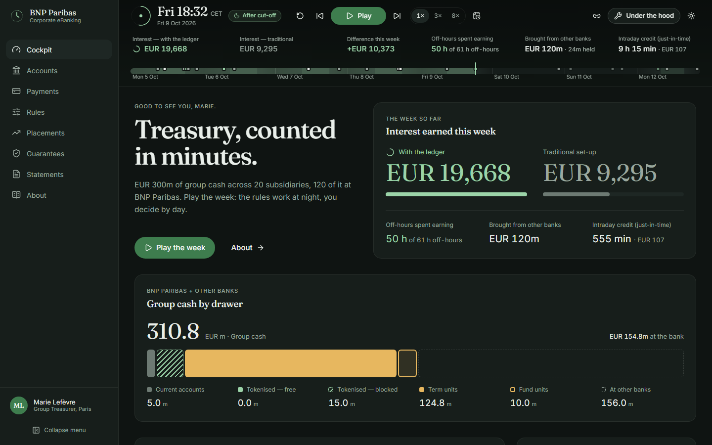

## Run it (under 3 minutes)

You need [Node.js](https://nodejs.org) 20 or later.

```bash
git clone <this repository>
cd <folder>
npm install
npm run dev
```

Open <http://localhost:5173>. That's it.

Or open the published version on GitHub Pages (see [Deploy](#deploy)).

## Play the week

1. Press **Play** (or the space bar). One simulated hour lasts about 1.5 seconds; switch to 3× or 8×
   to go faster.
2. Press **Next event** (⏭) to step through the story, or the calendar icon to **jump** to any of
   the 17 moments of the week.
3. **Drag the timeline** under the counters to move the clock anywhere. Shaded parts are nights and
   the weekend.
4. Watch the **counters** at the top: interest with the ledger vs the traditional set-up, hours
   spent earning, cash brought from other banks, intraday credit. Hover any of them for the formula.
5. Open **Under the hood** (top right) for what happens inside the bank: ledger entries to the
   second, rule decisions, minute-by-minute accruals, the ALM view, intragroup mirror balances.
6. **Act yourself**: buy or sell a unit (Placements), fund Singapore at night (Payments › Intragroup
   on the ledger), subscribe to the fund, approve a batch. Your actions replay on the week;
   **Reset to scenario** removes them.
7. **Share a moment**: the URL carries the clock, e.g. `/?t=2026-10-09T18:30`. The link icon copies
   it.

Colour code everywhere: **green** is what the ledger adds, **grey** is what already works today,
**dashed** is outside the bank, **amber** is term units and fund.

Good moments to start from:

| Moment | Link | What to look at |
|---|---|---|
| Mon 18:30 | `/?t=2026-10-05T18:30` | Surplus swept, overnight unit bought — late cash earns |
| Mon 22:00 | `/accounts?t=2026-10-05T22:00` | USD receipt "pending cover", not earning |
| Wed 21:30 | `/accounts/tok-paris?t=2026-10-07T21:30` | Blocked collateral inside the overnight unit |
| Sat 22:00 | `/payments?t=2026-10-10T22:00&tab=ledger` | Out-of-hours FX to fund Singapore |
| Sun 19:00 | `/guarantees?t=2026-10-11T19:00` | Bid bond released by rule, interest to the minute |
| Mon 10:00 | `/placements?t=2026-10-12T10:00` | Sell a term unit instead of breaking a deposit |
| Mon 20:00 | `/payments?t=2026-10-12T20:00&tab=ledger` | Night payment to a non-client: not yet (2028) |
| Mon 21:00 | `/minute?t=2026-10-12T21:00` | Where the minute counts: six situations, daily vs minute |
| Sat 21:00 | `/funding?t=2026-10-10T21:00` | Yen for Tokyo at Mon 02:00 Paris, SAR for Riyadh on Sunday — desks closed |
| Mon 11:00 | `/escrow?t=2026-10-12T11:00` | Deploy an escrow, send oracle events (valid and forged) |
| Sat 21:00 | `/corridors?t=2026-10-10T21:00` | Interbank corridors, current vs tokenised, LatAm repatriation |

## The doctrine in 12 lines

1. The tokenised account is a service account: 0.10 %, never more than the current account (0.50 %).
2. Time is counted to the minute on the tokenised account; the current account counts end-of-day balances.
3. The clock follows finality: no interest before funds are final on the paying entity's books.
4. Yield lives in term units bought from the tokenised account — transferable before maturity, never broken.
5. Late cash earns: after 18:00, idle balances go into an overnight unit that minute (three-day on Friday).
6. Collateral keeps earning until the minute a rule releases it.
7. Just-in-time funding at any hour: a subsidiary pays only for the minutes it borrows.
8. Out-of-hours FX is for intragroup funding only, within a published night limit (EUR 25m).
9. The tokenised fund is an option, not the engine: settled on the ledger, within fund hours.
10. The night sweep brings cash from other banks by instant transfer and returns only what each bank needs.
11. Payments, payroll, tax, forecasting, statements, reconciliation, closing and netting do not change.
12. Across banks: pilot corridors work with partner banks on the interbank ledger; elsewhere night payments to non-clients, PvP and settlement with non-clients wait for the interbank layer (2028+).

Full text: [docs/DOCTRINE.md](docs/DOCTRINE.md). The week: [docs/SCENARIO.md](docs/SCENARIO.md).
Choices made where the brief was silent: [docs/ASSUMPTIONS.md](docs/ASSUMPTIONS.md).

## Screens

| | |
|---|---|
| 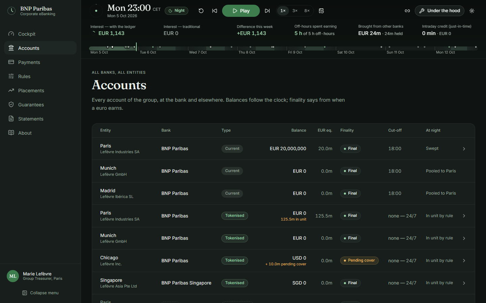 **Accounts** — every account across banks, finality state, night behaviour; "same euro, two accounts". | 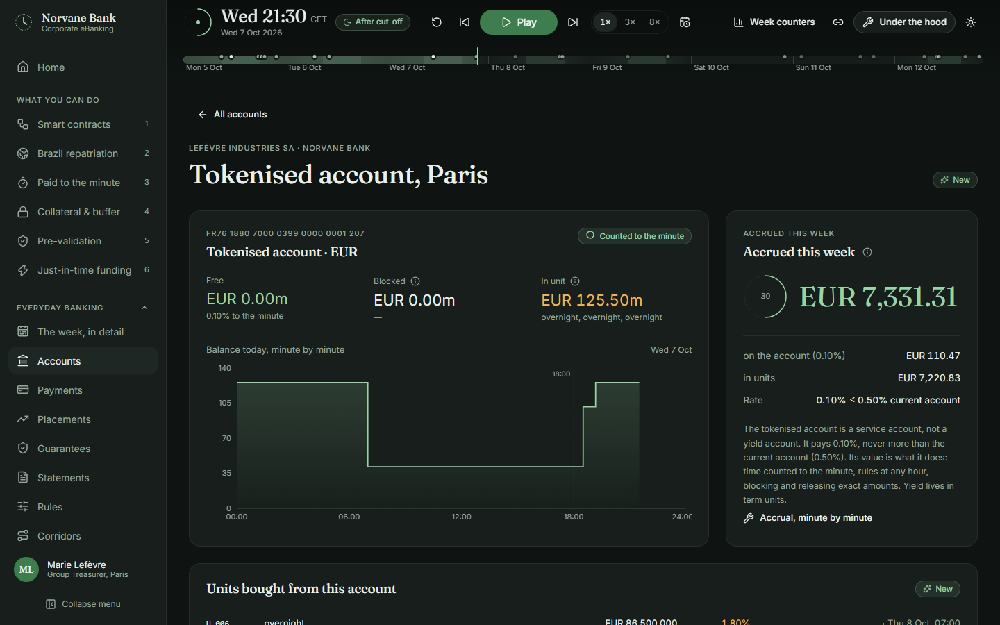 **Tokenised account** — free / blocked / in unit, minute chart, live accrual. |
| 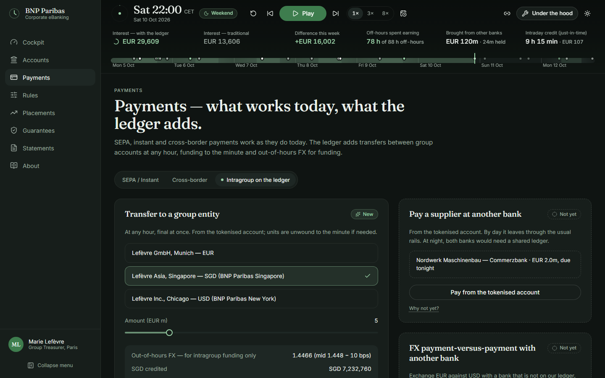 **Payments** — SEPA and cross-border as today; intragroup on the ledger with pre-screening. | 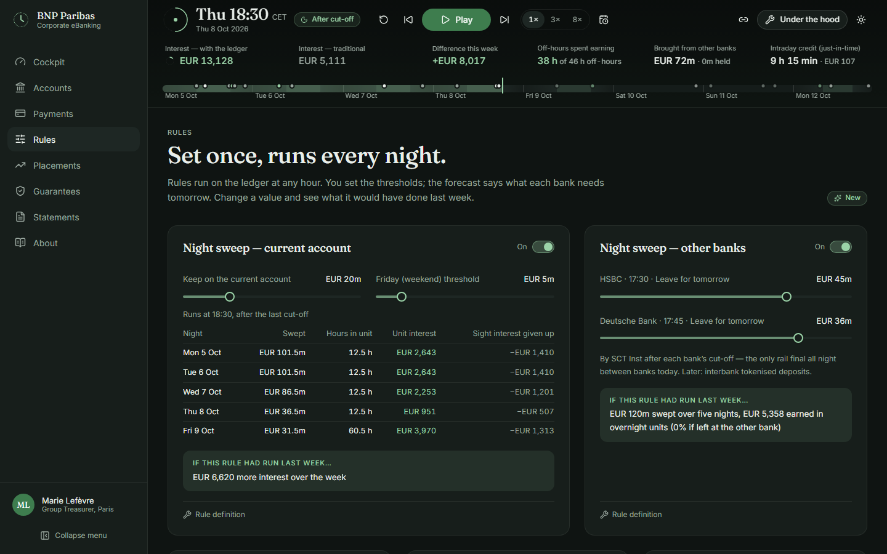 **Rules** — set once, runs every night; "if this rule had run last week…". |
| 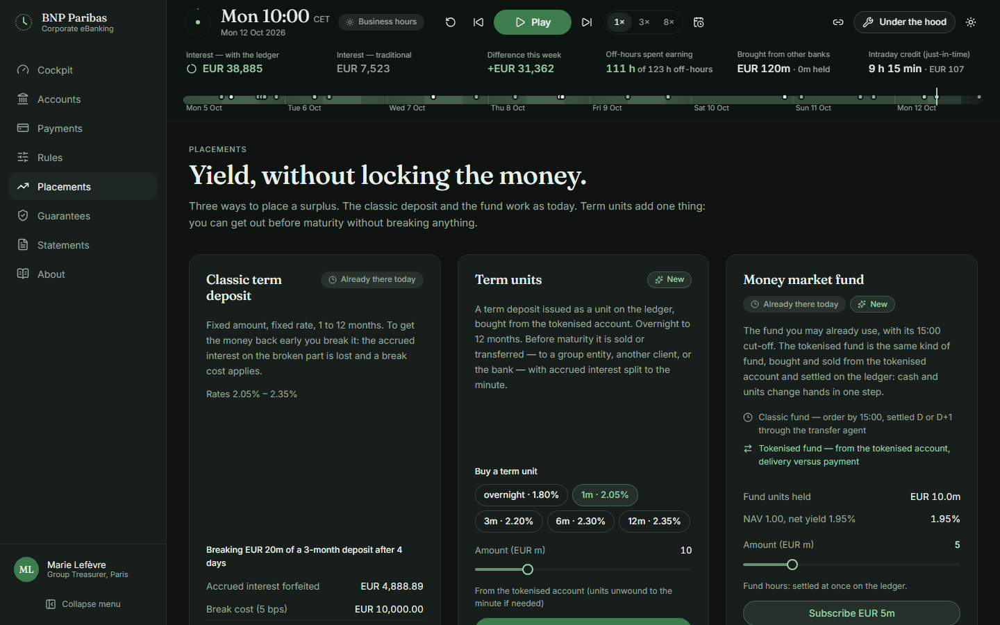 **Placements** — classic deposit, term units, fund; the yield ladder. | 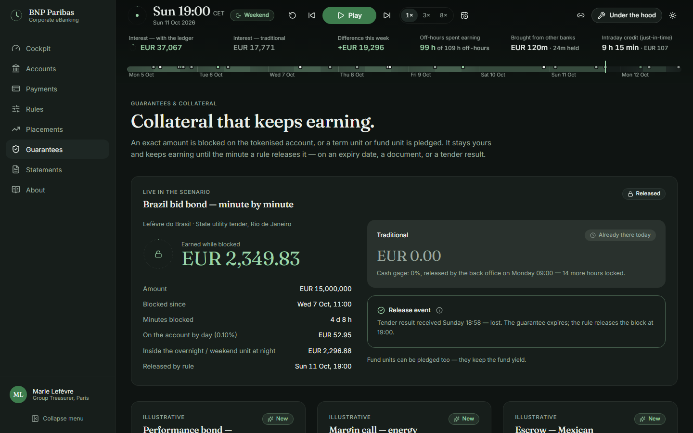 **Guarantees** — collateral that keeps earning, released by rule. |
| 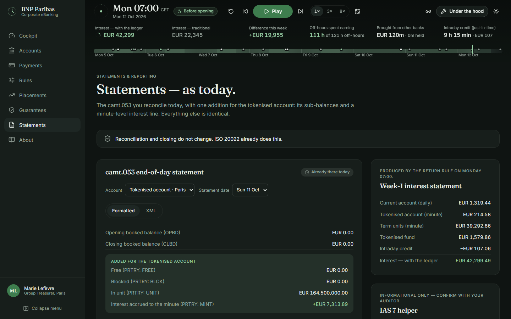 **Statements** — camt.053 as today, plus sub-balances and a minute interest line. | 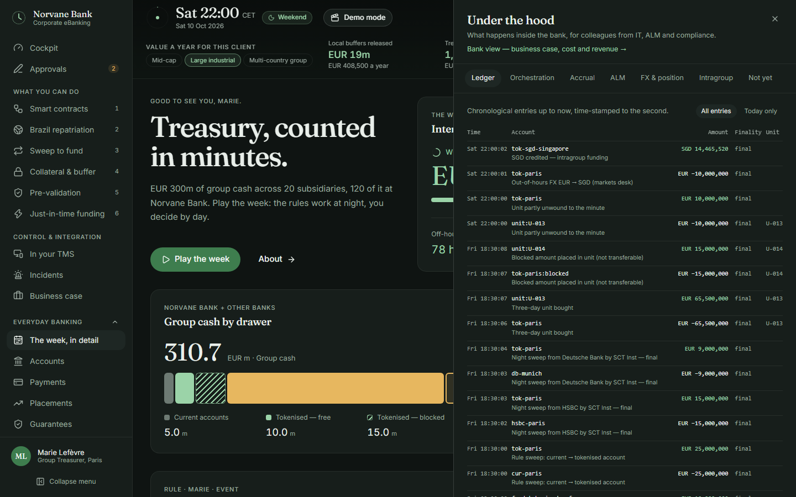 **Under the hood** — ledger, orchestration, accrual, ALM, intragroup, not yet. |
| 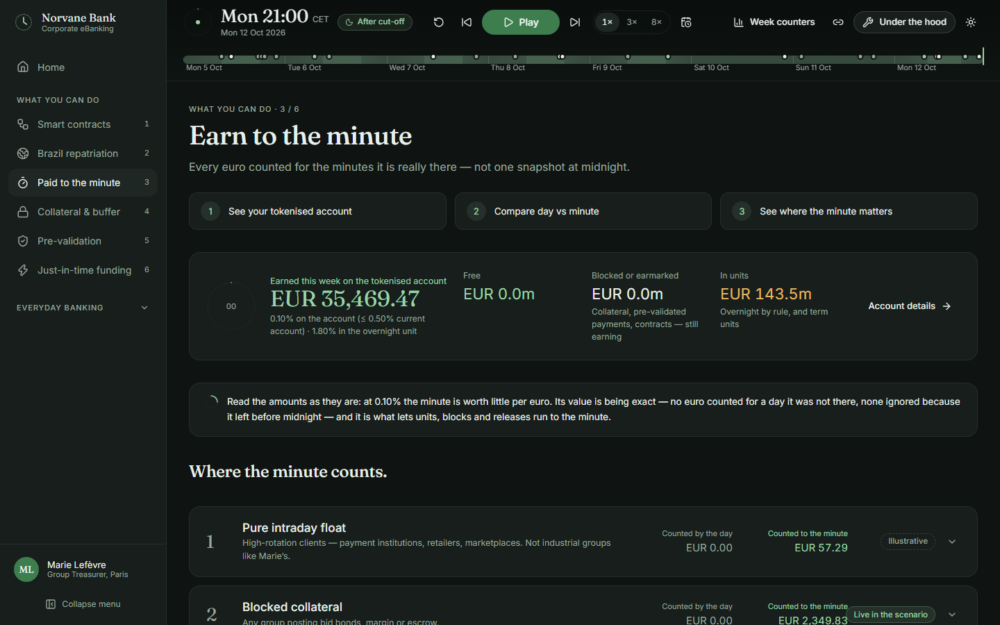 **Why the minute** — six situations where money stays on the account and the minute matters. |  **Funding** — just-in-time in JPY / SAR / SGD from EUR or USD when desks are closed; large payments pre-validated. |
|  **Escrow** — purpose-bound money on the tokenised account, programmable rule, oracle API. | 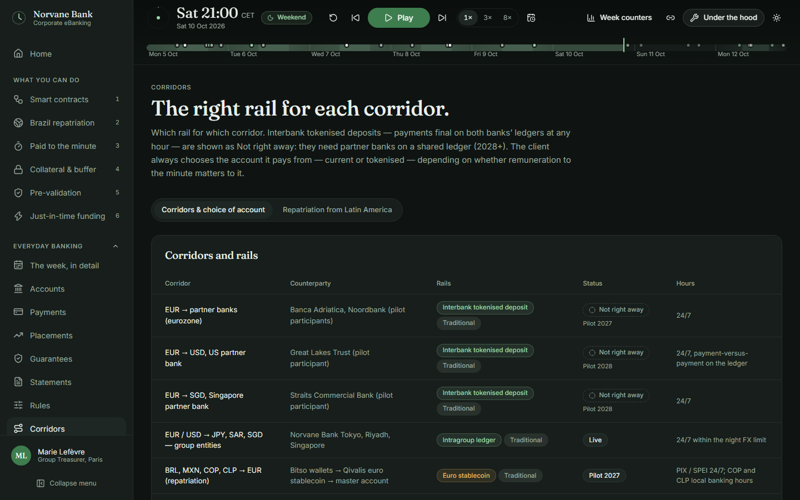 **Corridors** — interbank tokenised deposits on pilot corridors, current or tokenised account, LatAm repatriation via partner wallets and a euro stablecoin. |

Light mode: 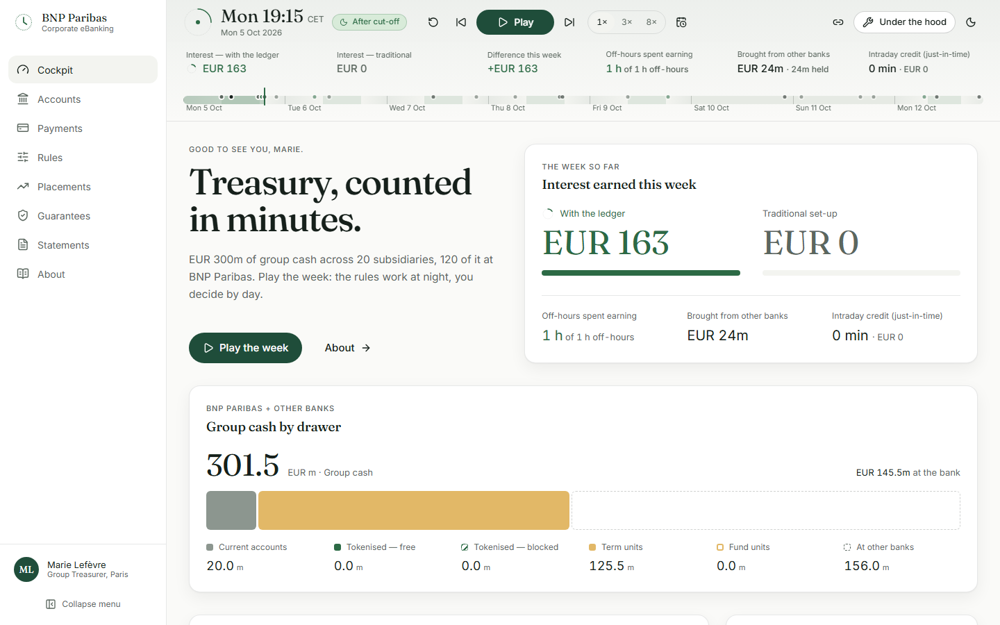

## How it is built

Vite · React 18 · TypeScript (strict) · Tailwind CSS 4 · shadcn/ui-style components on Radix ·
Zustand · Recharts · lucide-react · Framer Motion · React Router.

```
src/
  engine/     pure logic, unit-tested
    clock.ts      simulated time, business hours, cut-offs
    accrual.ts    minute accrual (Actual/360) and daily end-of-day accrual
    finality.ts   "the clock follows finality"
    rules.ts      sweep, overnight unit, night sweep, return
    pricing.ts    unit sale price, night FX quote, deposit break cost
    scenario.ts   the week as data + the traditional twin
    timeline.ts   the reducer: one snapshot per event, ledger, orchestration log
    counters.ts   the five weekly counters
    preview.ts    "if this rule had run last week…"
    userActions.ts  your actions, replayed on the week
  app/        router and Zustand store
  screens/    the 8 screens
  components/ layout, hood panel, charts, ui primitives
  data/       rates, entities, banks, accounts, rules, forecast
  i18n/en.ts  every client-facing string (add fr.ts for French)
tests/
  unit/       engine, scenario table, copy vocabulary
  e2e/        Playwright smoke tests
```

The whole UI re-renders from one simulated minute: `useSim()` returns the state at that minute,
computed by replaying the scenario. Nothing is stored in the screens.

## Commands

| | |
|---|---|
| `npm run dev` | Development server |
| `npm run build` | Type-check and build to `dist/` |
| `npm test` | Engine unit tests (the §3.1 state table, doctrine, accrual, pricing) |
| `npm run lint` | ESLint |
| `npm run e2e` | Playwright smoke tests (first time: `npx playwright install chromium`) |
| `node scripts/screenshots.mjs` | Refresh README screenshots (needs `npx vite preview --port 4173` running) |

## Deploy

`.github/workflows/ci.yml` runs lint, tests, build and the Playwright tests on every push.
`.github/workflows/deploy.yml` publishes `main` to GitHub Pages. In the repository settings, set
**Pages › Source** to **GitHub Actions** once. The site is then served at
`https://<owner>.github.io/<repository>/`; deep links work (a copy of `index.html` is served as
`404.html`).

## What this is not

All rates, amounts, names and limits are illustrative. The bank is anonymised as **Norvane Bank**;
the group and its counterparties are fictitious. The corridor partner (Bitso) and the euro
stablecoin (Qivalis) are named as placeholders to validate with Partnerships, Legal and Compliance. The interbank ledger, PvP with other banks, settlement with non-clients and stablecoin
corridors are not built; they appear as "Not yet". See the **About** page in the app.

Contributing: [CONTRIBUTING.md](CONTRIBUTING.md) — how to add a scenario event.
Licence: internal use, see [LICENSE.md](LICENSE.md).
