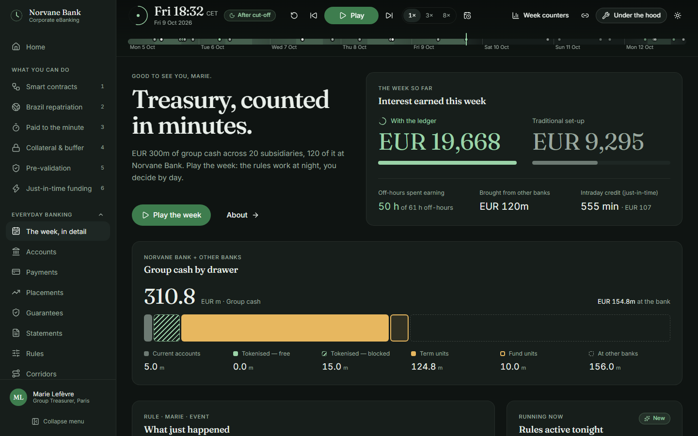

# Treasury, counted in minutes

A clickable mock-up of a corporate eBanking portal for a group treasurer, built around **six
things the tokenised account lets you do**. You sit in Marie Lefèvre's chair (Group Treasurer,
Paris) at **Norvane Bank** (a fictitious bank), on a simulated week.

1. **Automate payments around an event** — smart contracts: purpose-bound money in escrow and
   cascade payments down a supply chain, released the minute an oracle confirms the event.
2. **Bring cash home from Brazil** — BRL → partner wallet → euro stablecoin → EUR on the
   tokenised account, rate locked, in minutes, even at the weekend.
3. **Earn to the minute** — every euro counted for the minutes it is really there; six situations
   where that matters, amounts shown honestly.
4. **Put the balance to work** — the same balance backs a guarantee and funds subsidiaries, and
   keeps earning while it waits (in an overnight unit at night).
5. **Pre-validate a large transfer** — every check done days ahead; on the day it leaves in seconds.
6. **Fund a subsidiary just in time** — euro or dollar into yen, riyal or Singapore dollar at the
   minute of need, when every desk and cut-off is closed.

Interbank use cases (a supplier's bank on a shared ledger) are shown with a **Not right away**
label. Everyday banking (accounts, payments, placements, statements, rules) stays one click away,
unchanged. Everything runs in the browser: mock data, a simulated clock, no backend, no login.


## Run it (under 3 minutes)

You need [Node.js](https://nodejs.org) 20 or later.

```bash
git clone <this repository>
cd <folder>
npm install
npm run dev
```

Open <http://localhost:5173>. That's it.

Or open the published version on GitHub Pages (see [Deploy](#deploy)).

## Use it

- **Home** offers the six journeys. Each one opens with its promise and three steps.
- The **clock** at the top drives everything: press **Play** (or the space bar), **Next event** (⏭)
  to step, or drag the week timeline. Night and weekend are shaded.
- **Act yourself**: deploy a contract and simulate the event, lock a rate and repatriate, pre-validate
  a payment, schedule a funding at the minute of need. Your actions replay on the week;
  **Reset to scenario** removes them.
- **Week counters** (top bar) shows interest with and without the ledger for the whole week.
- **Under the hood** shows ledger entries to the second, rule decisions, minute accruals, the ALM
  view and intragroup mirror balances.
- The URL carries the clock (`?t=2026-10-10T21:00`): copy it to share a moment.

| Journey                 | Start here                            | What to do                                               |
| ----------------------- | ------------------------------------- | -------------------------------------------------------- |
| Smart contracts         | `/smart-contracts?t=2026-10-12T11:00` | Deploy the cascade, press "Simulate the event"           |
| Brazil repatriation     | `/repatriation?t=2026-10-10T21:00`    | Lock the rate on Saturday night, then ⏭ a few times      |
| Earn to the minute      | `/minute?t=2026-10-12T21:00`          | Open each case: by the day vs to the minute              |
| Put the balance to work | `/put-to-work?t=2026-10-07T21:30`     | Collateral and buffer, earning in a unit at night        |
| Pre-validation          | `/pre-validation?t=2026-10-12T11:00`  | Pre-validate the M&A closing, then release it            |
| Just in time            | `/just-in-time?t=2026-10-10T21:00`    | Tokyo at Mon 02:00 Paris: schedule at the minute of need |

## The doctrine in 12 lines

1. The tokenised account is a service account: 0.10 %, never more than the current account (0.50 %).
2. Time is counted to the minute on the tokenised account; the current account counts end-of-day balances.
3. The clock follows finality: no interest before funds are final on the paying entity's books.
4. Yield lives in term units bought from the tokenised account — transferable before maturity, never broken.
5. Late cash earns: after 18:00, idle balances go into an overnight unit that minute (three-day on Friday).
6. Collateral keeps earning until the minute a rule releases it.
7. Just-in-time funding at any hour: a subsidiary pays only for the minutes it borrows.
8. Out-of-hours FX is for intragroup funding only, within a published night limit (EUR 25m).
9. The tokenised fund is an option, not the engine: settled on the ledger, within fund hours.
10. The night sweep brings cash from other banks by instant transfer and returns only what each bank needs.
11. Payments, payroll, tax, forecasting, statements, reconciliation, closing and netting do not change.
12. Across banks, not right away: payments to other banks at night, PvP and settlement with non-clients need the interbank layer (2028+) — shown with a "Not right away" label.

Full text: [docs/DOCTRINE.md](docs/DOCTRINE.md). The week: [docs/SCENARIO.md](docs/SCENARIO.md).
Choices made where the brief was silent: [docs/ASSUMPTIONS.md](docs/ASSUMPTIONS.md).

## Screens

|                                                                                                                                  |                                                                                                                      |
| -------------------------------------------------------------------------------------------------------------------------------- | -------------------------------------------------------------------------------------------------------------------- |
|  **1 · Smart contracts** — event → payments, cascade, oracle API for IT. |  **2 · Brazil repatriation** — where the money is, minute by minute.     |
|  **3 · Earn to the minute** — the account, then six situations.                            |  **4 · Put the balance to work** — collateral, buffer, the night in a unit. |
|  **5 · Pre-validation** — checks done ahead, release in seconds.           |  **6 · Just in time** — who is open, ledger vs pre-funding.        |
|  **The week, in detail** — the original cockpit, in Everyday banking.                          |  **Under the hood** — ledger, orchestration, accrual, ALM.               |

Light mode: 

## How it is built

Vite · React 18 · TypeScript (strict) · Tailwind CSS 4 · shadcn/ui-style components on Radix ·
Zustand · Recharts · lucide-react · Framer Motion · React Router.

```
src/
  engine/     pure logic, unit-tested
    clock.ts      simulated time, business hours, cut-offs
    accrual.ts    minute accrual (Actual/360) and daily end-of-day accrual
    finality.ts   "the clock follows finality"
    rules.ts      sweep, overnight unit, night sweep, return
    pricing.ts    unit sale price, night FX quote, deposit break cost
    scenario.ts   the week as data + the traditional twin
    timeline.ts   the reducer: one snapshot per event, ledger, orchestration log
    counters.ts   the five weekly counters
    preview.ts    "if this rule had run last week…"
    userActions.ts  your actions, replayed on the week
  app/        router and Zustand store
  screens/    the 8 screens
  components/ layout, hood panel, charts, ui primitives
  data/       rates, entities, banks, accounts, rules, forecast
  i18n/en.ts  every client-facing string (add fr.ts for French)
tests/
  unit/       engine, scenario table, copy vocabulary
  e2e/        Playwright smoke tests
```

The whole UI re-renders from one simulated minute: `useSim()` returns the state at that minute,
computed by replaying the scenario. Nothing is stored in the screens.

## Commands

|                                |                                                                           |
| ------------------------------ | ------------------------------------------------------------------------- |
| `npm run dev`                  | Development server                                                        |
| `npm run build`                | Type-check and build to `dist/`                                           |
| `npm test`                     | Engine unit tests (the §3.1 state table, doctrine, accrual, pricing)      |
| `npm run lint`                 | ESLint                                                                    |
| `npm run e2e`                  | Playwright smoke tests (first time: `npx playwright install chromium`)    |
| `node scripts/screenshots.mjs` | Refresh README screenshots (needs `npx vite preview --port 4173` running) |

## Deploy

`.github/workflows/ci.yml` runs lint, tests, build and the Playwright tests on every push.
`.github/workflows/deploy.yml` publishes `main` to GitHub Pages. In the repository settings, set
**Pages › Source** to **GitHub Actions** once. The site is then served at
`https://<owner>.github.io/<repository>/`; deep links work (a copy of `index.html` is served as
`404.html`).

## What this is not

All rates, amounts, names and limits are illustrative. The bank is anonymised as **Norvane Bank**;
the group and its counterparties are fictitious. The corridor partner (Bitso) and the euro
stablecoin (Qivalis) are named as placeholders to validate with Partnerships, Legal and Compliance. The interbank ledger, PvP with other banks, settlement with non-clients and stablecoin
corridors are not built; they appear as "Not yet". See the **About** page in the app.

Contributing: [CONTRIBUTING.md](CONTRIBUTING.md) — how to add a scenario event.
Licence: internal use, see [LICENSE.md](LICENSE.md).
